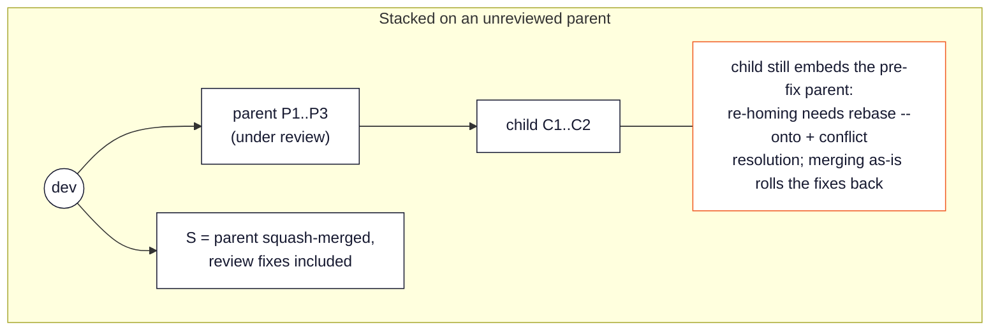
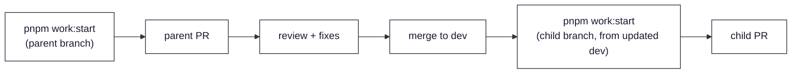

# Repo Conventions

## Branch flow: `feature` → `dev` → `main`

Two long-lived branches map to two Netlify environments:

- `dev` — the dev/staging environment (Netlify branch deploy,
  https://dev--marvelous-crepe-8a78fb.netlify.app)
- `main` — production (push deploys to https://enmaru.kasumin.biz)

Work branches (`feature/...`, `fix/...`, etc.) open their PR against `dev`. Once
verified on the dev deploy, `dev` is promoted to `main` to release. So merging a
work PR is _not_ releasing — promoting `dev` → `main` is. There is no release tag.
Keep both branches deployable: CI green, verified behavior.

For the step-by-step path from starting a task to requesting review, see
[`docs/development.md`](../development.md) — this file carries the
conventions behind those steps.

## Branch naming

Branches use a `<type>/<description>` form. Common types:

- `feature/...` — new functionality
- `fix/...` — bug fix
- `chore/...` — documentation, configuration, or other non-behavior changes
- `refactor/...` — internal restructuring without behavior change

When the work has a related issue, prefix the description with the issue number
for traceability: `feature/12-reservation-list`, `chore/5-implementation-policy-docs`.

## Starting a work item

Start every work item with:

```bash
pnpm work:start feature/12-reservation-list
```

The script fetches origin, checks that the working tree is clean, and creates
the branch from `origin/dev`. If the tree holds leftovers (edits or untracked
files from earlier work), it lists them and asks — stash, delete (with a
confirmation), or abort. Without a TTY it never deletes: it aborts, or stashes
when run as `pnpm work:start --stash <branch>`.

This is a mechanism, not a memo. A dirty working tree is how other work items'
files end up committed into your branch: `git status` noise gets swept into a
commit, and the PR then carries foreign migrations, `schema.prisma` state, or
pre-review copies of files a merged PR already fixed — which a merge would
silently roll back. Keeping the tree owned by exactly one work item at a time
(and `.gitignore`-ing what should never be tracked) is what makes bulk staging
like `git add -A` safe to use.

## Dependent work: serialize, don't stack

When new work depends on a PR that is not merged yet, **wait: finish the
parent through review and merge, then start the child from the updated
`dev`** (with `pnpm work:start`, which enforces exactly that). Do not stack a
branch on top of an unmerged branch.

Why: an open PR is an unvalidated foundation. Review will change it — and the
child keeps embedding the pre-fix version:



The safe flow costs only waiting, and the wait buys a reviewed foundation:



If two PRs genuinely must stack (rare — treat it as an expert-mode exception),
branch from the parent, set the dependent PR's base branch accordingly, and
say so in its body. After the parent merges (squash), re-home the child with
`git rebase --onto origin/dev <last-parent-commit>` — the boundary argument
replays only the commits after it (the child's own) onto `dev`, dropping the
parent's pre-fix commits that the squash already superseded.

Before opening the PR, verify the branch contains only your change:

```bash
git fetch origin
git diff origin/dev --stat
```

This gate is designed for the coding agent, not for human attention: the agent
knows the work item's scope, so it can judge each listed path against it
("this is a seeker PR — why is a nursery migration in the list?") and report
anything it cannot explain. Anything unrelated means the tree was dirty when
the work started — fix that before asking for review. The check is file-level;
foreign edits inside a file you also touched are not its job (a clean tree at
start plus serialized work prevents those, and review remains the last net).

## Commits

- Small, focused commits; imperative mood for the subject line.
- Check `git status` before staging. Bulk staging (`git add -A`) is fine only
  because the working tree holds nothing but this work item (see "Starting a
  work item") — if unexpected files show up, resolve them first.
- Separate subject and body with a blank line; the body explains _why_ and _how_.
- Prefix the subject with an emoji to categorize the change:

| Emoji | Meaning                 |
| :---: | :---------------------- |
| `🔖`  | Version tag / release   |
| `✨`  | New feature             |
| `🐛`  | Bug fix                 |
| `♻️`  | Refactoring             |
| `🎨`  | UI/UX                   |
| `🐎`  | Performance             |
| `🔧`  | Tooling / configuration |
| `🚨`  | Tests                   |
| `📝`  | Documentation           |
| `💩`  | Deprecation             |
| `🗑️`  | Removal                 |
| `🚧`  | Work in progress        |

Keep history readable on `main`. On a working branch, commit however you need to
while working — but before merging, clean up the history (squash, rebase, reword)
so that what lands reads as a coherent set of meaningful commits.

## Database migrations

- **One squashed migration per PR.** Finalize the schema change first, then run
  `pnpm db:migrate` once. If iterating left several migration directories in
  the PR (e.g. a CREATE TABLE followed by an ALTER of the same table minutes
  later), squash them before review: delete the extra directories and
  regenerate a single migration's SQL from the schema diff —

  ```bash
  git show origin/dev:prisma/schema.prisma > /tmp/dev-schema.prisma
  pnpm exec prisma migrate diff \
    --from-schema /tmp/dev-schema.prisma \
    --to-schema prisma/schema.prisma \
    --script > prisma/migrations/<timestamp>_<name>/migration.sql
  ```

  Squashing is safe only while the migrations are unapplied outside your own
  dev work — which is the normal state until the PR merges.

- **Never edit or rename an applied migration.** Prisma records each applied
  migration's checksum in `_prisma_migrations`; changing the file afterwards
  makes every database that ran it report drift and demand a reset.
- Deploys do not run migrations; applying them to an environment is a manual
  step — see
  [`docs/operations.md`](../operations.md#running-database-migrations). Note
  that the dev database is shared by local development and the dev deploy, so
  `pnpm db:migrate` on a work branch changes it for everyone.

## Issues

- State precisely what is observed or what is needed — nothing less, nothing
  more. Speculation about causes belongs in a PR or a comment, not the issue
  body.
- Include observed details (timing, environment, error messages, reproduction
  steps) when they may be useful clues.
- Title is descriptive; no emoji or bracket prefix (e.g., `[Feature]`).
- Set properties (assignee, labels, etc.) appropriately.

## Pull Requests

- Describe what changes and why — precisely, no excess. The diff shows _what_;
  the description carries the _why_ and any non-obvious context.
- Record decisions: when an approach was chosen over alternatives, note the
  trade-offs that led to it. This prevents the same question from being
  re-evaluated later.
- Include evidence of verification (what was tested, what was observed) in a test
  plan. CI covers format / lint / typecheck / unit, but not feature behavior — see
  "Ship with care" in [`index.md`](index.md).
- Title is descriptive; no emoji or bracket prefix.
- Link the related issue with `Closes #N`.
- Before requesting review, walk the pre-review checklist in the PR template
  (branch cut from `dev`, `git diff origin/dev --stat` clean, at most one new
  migration).

## Coding agent setup

The canonical agent guide is [`AGENTS.md`](../../AGENTS.md). Point your coding
agent at it; `CLAUDE.md` already references it.
